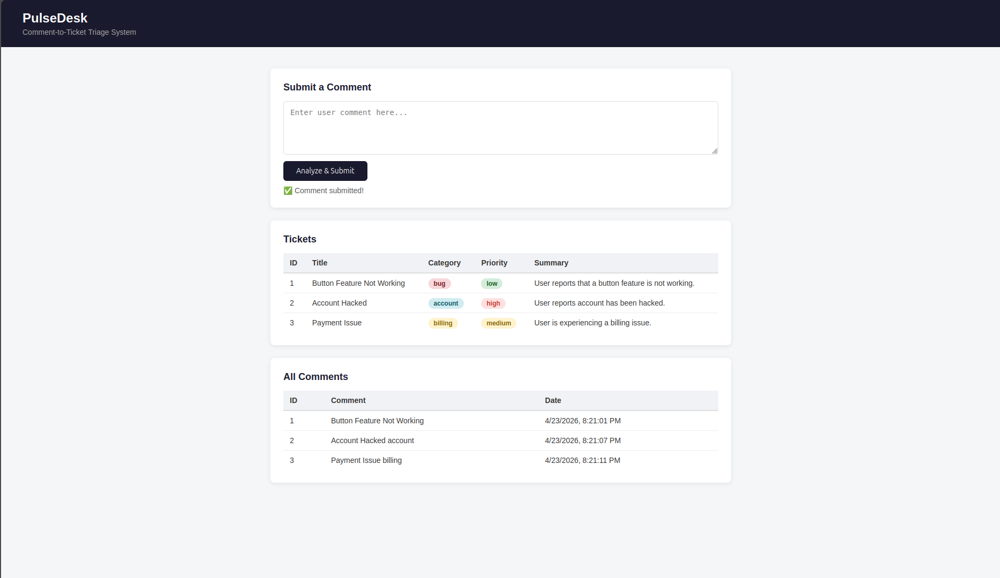

# PulseDesk – Comment-to-Ticket Triage

A Spring Boot backend that automatically analyzes user comments using AI and converts them into support tickets.

## How It Works

Each submitted comment is analyzed by the `Qwen/Qwen2.5-7B-Instruct` model via Hugging Face Inference API. The AI decides whether the comment should become a support ticket, and if so, generates a title, category, priority, and summary.

## Tech Stack

- Java 17
- Spring Boot 4.0.5
- Spring Data JPA + H2 (in-memory database)
- Hugging Face Inference API

## Requirements Checklist

- ✅ Submit and view comments (`POST /comments`, `GET /comments`)
- ✅ Analyze comments using Hugging Face Inference API
- ✅ Decide if comment should become a ticket
- ✅ Generate title, category, priority, and summary
- ✅ Store data in H2 in-memory database
- ✅ API to view tickets (`GET /tickets`, `GET /tickets/{id}`)
- ✅ Simple UI (bonus)

## UI

A simple web interface is available at `http://localhost:8080`



## Setup

### 1. Clone the repository
```bash
git clone https://github.com/FeatureAlek/pulsedesk-backend
cd pulsedesk
```

### 2. Configure API token
Copy the example properties file:
```bash
cp src/main/resources/application.properties.example src/main/resources/application.properties
```
Then edit `application.properties` and replace `your_token_here` with your Hugging Face token.

> Get a token at huggingface.co → Settings → Access Tokens  
> Required permission: **Make calls to Inference Providers**

### 3. Run the application
```bash
./mvnw spring-boot:run
```

The app runs on `http://localhost:8080`

## API Endpoints

| Method | Endpoint | Description |
|--------|----------|-------------|
| POST | `/comments` | Submit a comment |
| GET | `/comments` | Get all comments |
| GET | `/tickets` | Get all tickets |
| GET | `/tickets/{id}` | Get ticket by ID |

## Example Usage

Submit a comment:
```bash
curl -X POST http://localhost:8080/comments \
  -H "Content-Type: application/json" \
  -d '{"content": "I cannot login to my account for 3 days!"}'
```

View generated tickets:
```bash
curl http://localhost:8080/tickets
```